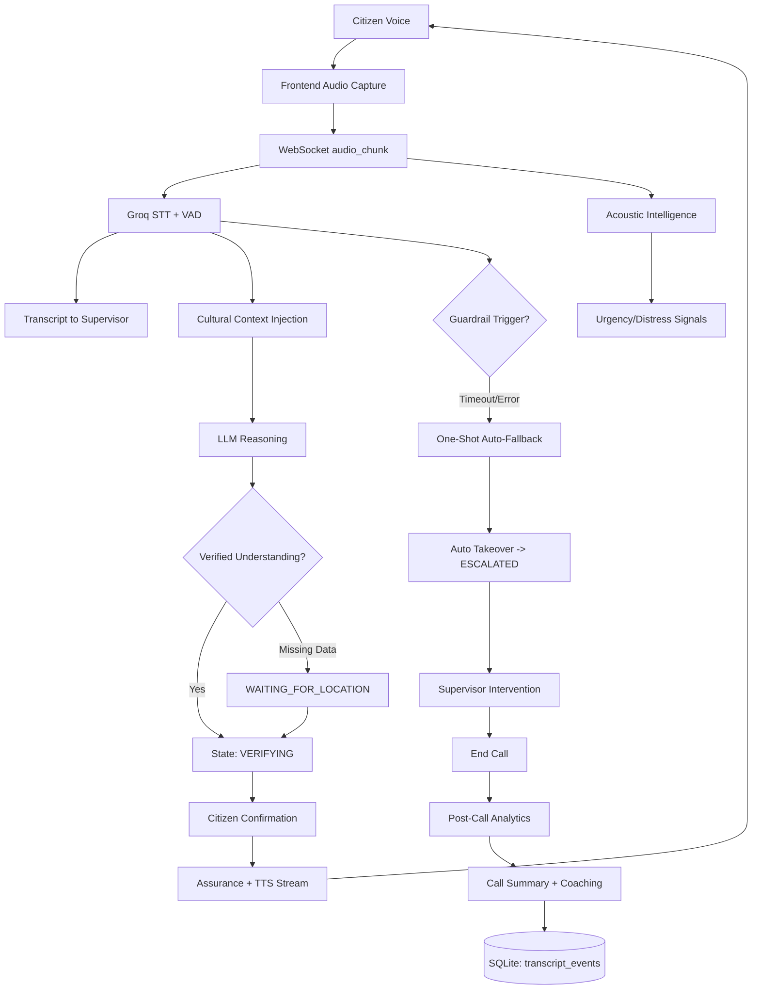

# VaakSetu v2.0 - Mission-Critical 1092 Helpline Intelligence


**Verified Understanding. Cultural Intelligence. Zero Dead-Air Response.**

VaakSetu v2.0 is a live emergency-call intelligence stack for the **1092 Helpline**, designed to reduce response risk caused by language variation, incomplete caller context, and panic-driven speech.

---

## Project Vision

Emergency callers do not speak in ideal conditions. They code-switch, use regional slang, omit details, and often speak under distress in noisy environments. Traditional pipelines lose precision exactly when precision matters most.

VaakSetu is built to solve this through:
- multilingual real-time transcription,
- dialect-aware contextual understanding,
- acoustic distress sensing,
- explicit verification loops before dispatch intent,
- and resilient auto-escalation when AI reliability degrades.

The mission remains operationally simple: **understand correctly first, then act.**

---

## v2.0 Architecture Updates

## 1) Resilient AI Architecture

### API Guardrail System
- In `backend/app/main.py`, call orchestration enforces explicit timeout rails:
  - `STT_TIMEOUT_SECONDS = 4.0`
  - `LLM_TIMEOUT_SECONDS = 12.0`
  - `ANALYTICS_TIMEOUT_SECONDS = 12.0`
- The 4-second STT guardrail prevents dead-air in live intake by failing fast into resilience logic if transcription stalls.

### One-Shot Fallback Protection
- `_activate_resilience_takeover()` triggers a technical-glitch voice response and transitions to human control.
- A one-shot flag (`fallback_triggered`) prevents repeated fallback spam, ensuring the caller always hears a controlled response once, not loops.

---

## 2) The Coach Analytics Engine (Post-Call Intelligence)

- `backend/app/services/analytics_service.py` generates a structured post-call `PerformanceReport`:
  - `understanding_score` (1-10)
  - `cultural_accuracy` (1-10)
  - `bottleneck_detected`
  - `coaching_tip`
- Current v2.0 implementation uses **Groq** (`llama-3.1-8b-instant`) with JSON-mode normalization for robust parsing.
- Reports are persisted into `backend/vaaksetu.db` (`transcript_events.analytics_report`) and surfaced to supervisors in the Call Summary modal.

---

## 3) Command Center UI/UX

- Supervisor UX is centered in `frontend/src/components/dashboard/SupervisorDashboard.tsx`.
- V2.0 includes:
  - dual views (`Live Call View` and `Records Dashboard`),
  - real-time call state breadcrumb,
  - urgency and acoustic widgets,
  - post-call coaching modal.
- Distress and urgency are represented as live intensity indicators ("heat" cues) via the vulnerability and acoustic widgets for rapid supervisor triage.
- Current codebase visual language is **high-contrast monochrome command-center styling** (white/black); neon/dark theme variants can be layered without architecture changes.

---

## 4) Performance Optimizations

- Streaming ingest path is chunked and real-time over WebSocket (`audio_chunk` flow).
- Background work is parallelized with `asyncio.gather(...)` in hot-path branches to reduce perceived latency.
- TTS is fragmented/chunk-streamed (`speech_service.synthesize`) so playback can begin before full synthesis completes.
- Filler-word short-circuiting avoids unnecessary LLM calls for low-information utterances.

---

## Core Intelligence Modules

- **Dialect-Aware RAG**: `backend/app/services/cultural_service.py` injects only detected slang definitions from `app/data/cultural_slang.json`.
- **Acoustic Intelligence**: `backend/app/services/acoustic_service.py` computes RMS, ZCR, noise floor, distress level, and environment class.
- **Verification Loop**: `backend/app/services/call_service.py` state machine enforces confirmation flow (`LISTENING`, `WAITING_FOR_LOCATION`, `VERIFYING`, `ASSURANCE`, `ESCALATED`).
- **Human-in-the-Loop**: `TOGGLE_TAKEOVER` can force/manual control; auto-escalation handles resilience failures.

---

## Updated System Diagram



---

## Tech Stack

| Layer | Technologies |
|---|---|
| Frontend | React 19, Vite, TypeScript, Shadcn UI, Lucide, Tailwind, Web Audio API, WebSocket |
| Backend | FastAPI, Uvicorn, Groq STT, Groq LLM (reasoning/analytics paths), Edge-TTS, SQLite, Pydantic |

---

## Installation & Setup

## Backend

```bash
cd backend
python -m venv .venv
```

Activate environment:

- Windows PowerShell:
```bash
.\.venv\Scripts\Activate.ps1
```
- Windows cmd:
```bash
.\.venv\Scripts\activate.bat
```
- Linux/macOS:
```bash
source .venv/bin/activate
```

Install:

```bash
pip install -r requirements.txt
```

Configure environment:

```bash
copy .env.example .env
```

Run backend:

```bash
uvicorn app.main:app --reload
```

## Frontend

```bash
cd frontend
npm install
copy .env.example .env
npm run dev
```

---

## Environment Variables (Current)

Backend (`backend/.env`):

| Variable | Required | Purpose |
|---|---|---|
| `APP_ENV` | No | Runtime mode |
| `APP_DEBUG` | No | Debug mode |
| `APP_HOST` | No | Host binding |
| `APP_PORT` | No | Port binding |
| `GROQ_API_KEY` | Yes | STT + LLM analytics/reasoning calls |
| `OPENAI_API_KEY` | Optional | Reserved compatibility |
| `DEEPGRAM_API_KEY` | Optional | Reserved compatibility |
| `ELEVENLABS_API_KEY` | Optional | Reserved compatibility |
| `VAD_ENERGY_THRESHOLD` | No | Voice activity gate sensitivity |
| `DATABASE_URL` | No | SQLite URL (`sqlite:///./vaaksetu.db`) |
| `CORS_ORIGINS` | No | Allowed frontend origins |
| `WS_HEARTBEAT_INTERVAL` | No | WS heartbeat interval |

Frontend (`frontend/.env`):

| Variable | Required | Purpose |
|---|---|---|
| `VITE_API_BASE_URL` | Yes | Backend HTTP base URL |
| `VITE_WS_BASE_URL` | Yes | Backend WebSocket URL |

---

## Impact

VaakSetu v2.0 is designed as a reusable public-safety intelligence layer for multilingual emergency handling. With policy and integration adaptation, this architecture scales cleanly to **112 / 108** operations:

- improved first-pass understanding under linguistic diversity,
- lower false dispatch intent via verification loops,
- faster human takeover under AI uncertainty,
- stronger after-action quality through coaching analytics.

**In emergency response, correct understanding is intervention.**
